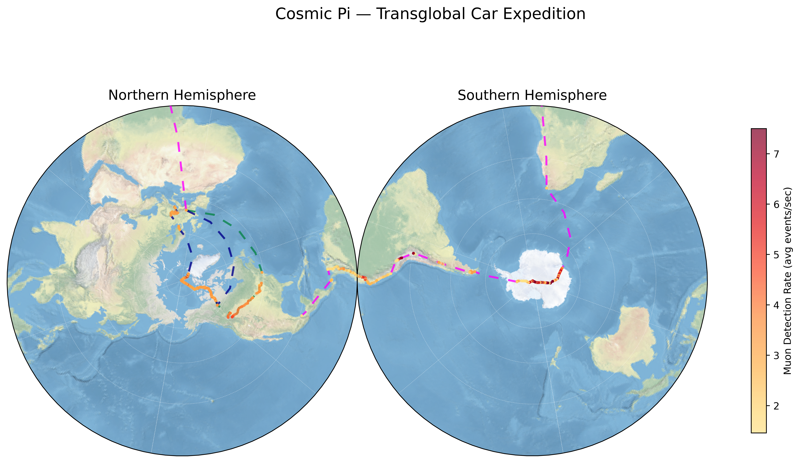

# Cosmic Pi Transglobal Visualization

Polar stereographic visualization of cosmic ray muon measurements collected during the [Transglobal Car Expedition](https://transglobalcar.com/science/cosmicpi) using Cosmic Pi detectors.

<p align="center">
  <picture>
    
  </picture>
</p>

## Background

Cosmic rays — high-energy particles from supernovae, black holes, and other violent events — constantly bombard Earth's atmosphere. When they collide with air molecules, they trigger cascading particle showers. Most particles are absorbed, but **muons** (heavy electrons, ~200x electron mass) reach ground level thanks to relativistic time dilation. About one muon hits every square centimeter of Earth's surface every minute.

The muon detection rate varies with altitude, latitude (Earth's magnetic field deflects more cosmic rays near the equator), and solar activity. Counting muons at ground level maps cosmic ray activity across the globe.

[**Cosmic Pi**](https://cosmicpi.org/) is a portable muon detector built at CERN. It uses a scintillator coupled with a light sensor to count muon hits, logging each detection alongside GPS, temperature, pressure, humidity, and accelerometer/magnetometer readings.

In 2024–2025, Cosmic Pi detectors were taken on the **Transglobal Car Expedition** — one of the first attempts to measure ground-level cosmic ray rates while driving to both poles:

- **North Pole (2024):** Across North America, up to the North Pole, back to Greenland
- **South Pole (2024/2025):** From Cape Town, through Antarctica, into South America

This project takes those raw measurements and visualizes the expedition routes and cosmic ray detection rates on polar stereographic maps.

## Datasets

- **North Pole (2024):** [Cosmic Pi North Pole Dataset 2024](https://zenodo.org/records/13310276) — First ground-level muon measurements at the North Pole, collected traveling across North America to the North Pole and back to Greenland. Authors: James Devine (CERN), Etam Noah Messomo. DOI: 10.5281/zenodo.13310276
- **South Pole (2024/2025):** [Cosmic Pi South Pole Dataset 2024/2025](https://zenodo.org/records/18774704) — First ground-level muon measurements through Antarctica, collected traveling from Cape Town through Antarctica and into South and Central America. Authors: Etam Noah Messomo, James Devine (CERN). DOI: 10.5281/zenodo.18774704

## Data

The detectors log to **InfluxDB 1.x** and the datasets are distributed as portable backups (opaque binary files). Each dataset contains two measurement streams:

- **`CosmicPiV1.8.1`** — environment stream (~5 Hz): GPS position, temperature, pressure, humidity, altitude, accelerometer, magnetometer
- **`CosmicPiV1.8.1_freq`** — cosmic ray events: muon detection count per interval + geohash-encoded location

| Dataset | Sensor rows | Freq rows | Zip size |
|---------|------------|-----------|----------|
| North Pole | 44.9M | 13.3M | 6.9 GB |
| South Pole | 9.6M | 2.7M | 533 MB |

The `ingest` command starts a temporary InfluxDB container, restores the backups, and exports everything to [GeoParquet](https://geoparquet.org/) files for fast local analysis.

## Setup

### 1. Download datasets

```bash
uv run cosmic-pi download
```

Downloads the two zip files from Zenodo (~7.4 GB total) into `input/`. Skips files already present.

### 2. Ingest data

Requires Docker. Starts InfluxDB, restores portable backups, exports to GeoParquet, and stops the container. InfluxDB data is persisted locally so re-runs skip the restore step.

```bash
uv run cosmic-pi ingest
```

### 3. Generate visualization

```bash
uv run cosmic-pi viz
```

Produces `output/cosmic_pi_transglobal_exp.png` with north and south polar stereographic projections side by side.

### Other commands

```bash
# Re-export from a running InfluxDB (e.g. after ingest --skip-teardown)
uv run cosmic-pi export

# Export a specific dataset/kind
uv run cosmic-pi export --dataset north --kind freq

# Remove persisted InfluxDB data to free disk space
uv run cosmic-pi clean
```
